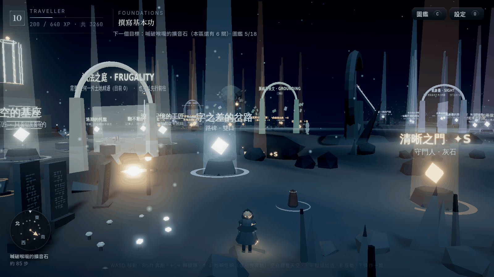
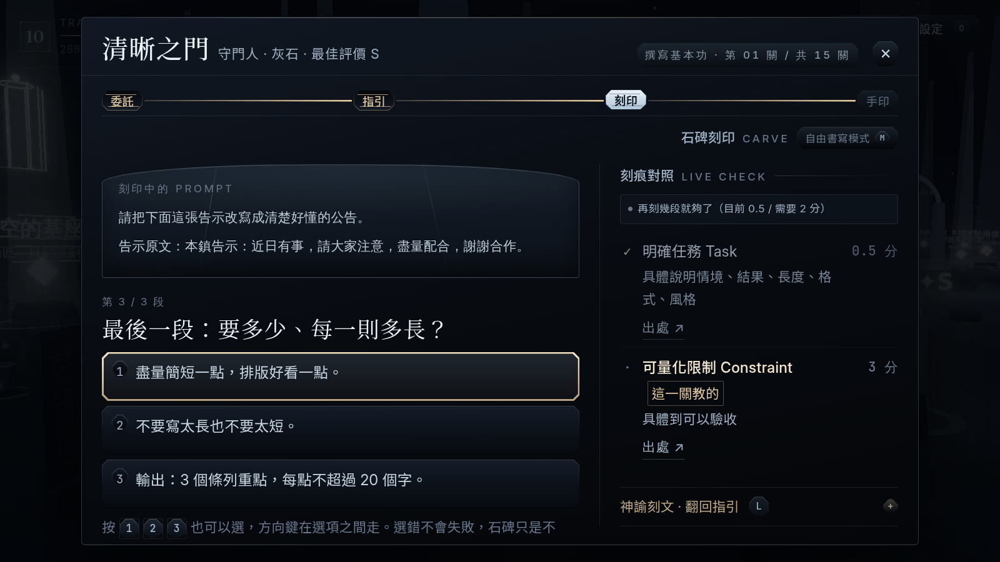
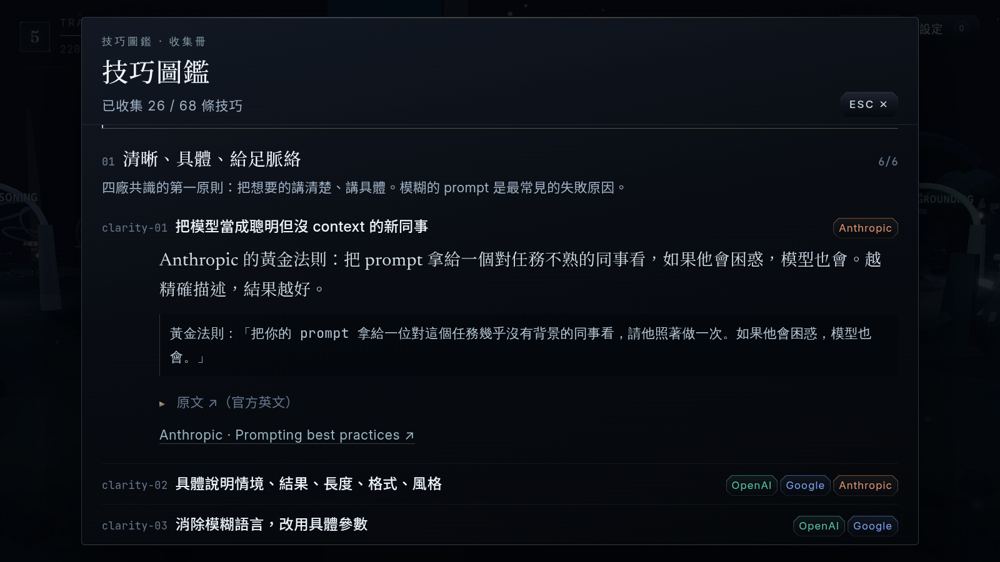
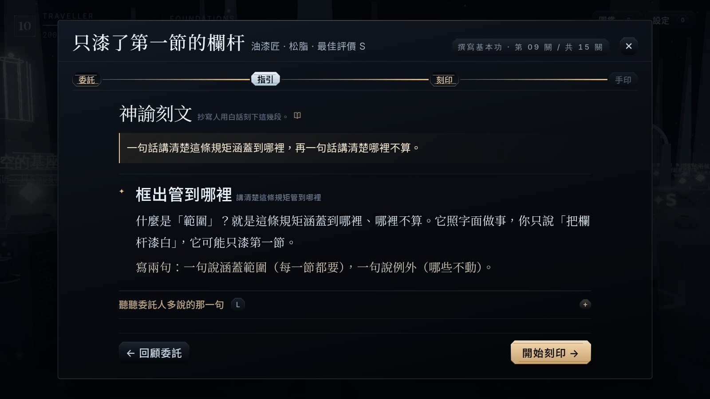
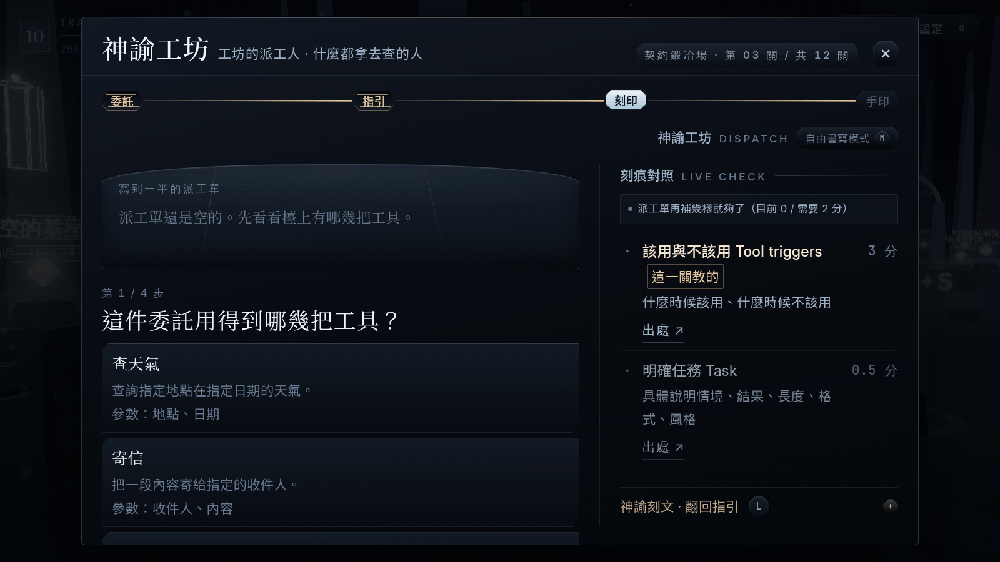
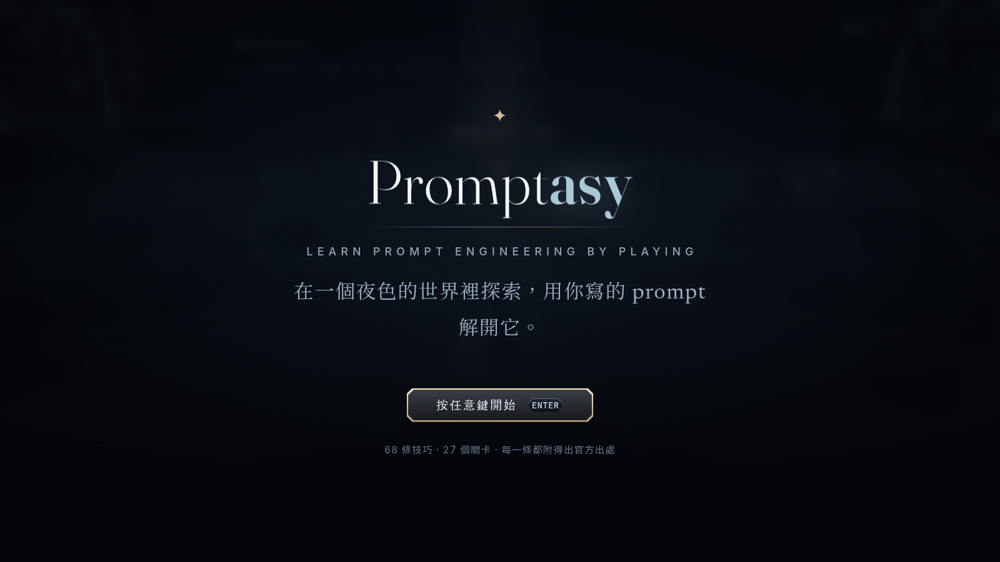

<div align="center">

# Promptasy

**Learn Prompt Engineering by Playing** — *prompt + fantasy*

[](https://threejs.org/)
[](https://vitejs.dev/)
[](#how-the-offline-scoring-works)
[](#tech-stack)
[](#content--sources)
[](#繁體中文)
[](#license)
[](#contributing)



</div>

---

## What is this

Promptasy is a browser game where you learn prompt engineering by **playing**, not by reading. You explore a
procedurally generated night world, walk up to a problem — a gatekeeper who can't understand you, an automaton
full of "don't"s, a workshop that needs a dispatch order — and solve it by **constructing a prompt**.

Every teaching shrine covers exactly one real skill from **official vendor documentation** — OpenAI, Anthropic,
Google, xAI and others (**130 skills, 445 source links**, all citable in-game; the original 68-technique compilation is
preserved byte-for-byte underneath). Scoring runs **entirely offline** — no model calls, no backend, no account — so
the core loop works on a plane, in a classroom, or behind a firewall.

The game's default answering mode is **not typing**: you pick sentence fragments and carve them into a stele, so
someone who has never written a prompt can still finish a challenge and learn *why* each fragment works.

> **The game UI is in Traditional Chinese (繁體中文).** The codebase, docs and code comments mix English and
> Chinese. An English UI is not available yet — see [Roadmap](#roadmap).

---

## Screenshots

| Guided challenge — carving a prompt | The codex — every entry cited |
| --- | --- |
|  |  |

| Guidance act — the plain-language teaching + its real source | The Oracle Workshop — a tool-dispatch puzzle |
| --- | --- |
|  |  |

<div align="center"></div>

> **Screenshots were captured on 2026-07-31 (Phase 32/34), when the world had 5 regions and 27 challenges.**
> They still show the real UI and art direction, but the counts on screen (challenge numbers, codex totals) predate
> the 12-region / 142-challenge curriculum v2 build described below. Re-shooting them is tracked as open work.

---

## Features

- **142 challenges across 12 regions** — 130 *teaching shrines* (one shrine ↔ one skill, never taught twice) plus
  12 *application trials*, one per region, that only test what you already learned there. Regions unlock on level,
  on progress in the previous region, or — for the newer lands — on **what you actually know**
  (a knowledge gate reads your collected skills, not your level).
- **Twelve ways to answer, one scoring engine** — eleven board types (*stele carving*, *order carving*, *repair*,
  *spot the flaw*, *induction*, *trade-off*, *constraint gauges*, *oracle workshop*, *two-round carving*, *dials*,
  *take-apart*) plus *free writing* for people who want to type the whole prompt. Every one of them submits the same
  text through the same offline engine, so grades are identical.
- **You cannot fail, only learn** — a wrong pick is *not accepted* by the stele: it shakes, and a plain-language
  explanation grows next to that option telling you why the weaker phrasing is weaker. No score penalty, no fail screen.
- **A guided prologue** — first boot walks you through four *teach-by-doing* gates (take a step, turn the camera,
  actually run, reach the shrine) and three hands-on lessons on core concepts, all quoted verbatim from vendor docs.
  Skippable, and replayable from settings.
- **Offline rubric engine** — **81 reusable checks** (`hasRole`, `hasFewShot`, `specifiesFormat`, `hasConstraint`,
  `decomposesTask`, `keepsPromptLean`, …) detect whether a *technique was applied*, using structure and bilingual
  pattern detection rather than string matching. Partial credit, evidence-based feedback, and anti-gaming
  (keyword soup scores zero).
- **Codex you fill up** — 130 skills across 12 regions plus the original 68 techniques in 15 topics, each expandable
  to its explanation, example, model differences and **every original source link**; region mastery seals, 12 land
  seals, an optional master layer (*penless* / *scribe* marks), four vendor badges, S/A/B/C grades, 8 rank titles and a
  shareable result card drawn locally on canvas (no third-party SDK, no tracking).
- **A world worth walking** — a central plateau, bridges and annexes leading to 12 lands, each with its own palette,
  fog, aurora drift and generative lighting; 12 landmarks visible from far away, 12 lore steles, 13 inscription
  whispers, 22 interactable objects across 8 kinds, and 4 map secrets. All procedural — zero model files.
- **Real soundtrack** — 6 original tracks (title + one per region, cross-faded when you cross a bridge) and 10 SFX.
  If the audio files are missing or blocked, a **Web Audio synth fallback** takes over and the game still sounds alive.
- **Keyboard-first** — the whole journey is playable without a mouse; focus traps, restored focus, visible focus rings,
  `prefers-reduced-motion`, and a `?` key that shows every binding at any time.
- **Self-hosted OFL fonts** — 6 families subset to ~1.1 MB from the project's actual corpus. **Zero CDN, zero external
  requests at runtime.**
- **Progress in localStorage** — no account, no server. Settings page has a one-click "reset and relearn" (with
  confirmation).
- **Static deploy** — `npm run build` produces a folder you can drop on GitHub Pages, Netlify or Vercel.

---

## Quick start

```bash
npm install
npm run dev          # local dev (http://localhost:5173)
npm run build        # static output to dist/
npm run preview      # preview the build
```

Requires **Node.js 18+**. `npm run test:e2e` additionally needs a system Chrome/Chromium (`CHROME_PATH` to point at it).

---

## Controls

> The whole game is playable from the keyboard. Press <kbd>?</kbd> at any time for the in-game list.

| Key | Action | 作用 |
| --- | --- | --- |
| <kbd>W</kbd><kbd>A</kbd><kbd>S</kbd><kbd>D</kbd> | Move | 移動 |
| <kbd>Shift</kbd> | Run | 奔跑 |
| <kbd>←</kbd><kbd>→</kbd> / drag | Turn camera | 轉鏡頭 |
| <kbd>↑</kbd><kbd>↓</kbd> / <kbd>Space</kbd> | Look up at the sky / down | 抬頭看天空 / 低頭 |
| <kbd>-</kbd><kbd>=</kbd> / wheel | Zoom out / in | 鏡頭拉遠 / 拉近 |
| <kbd>E</kbd> | Interact — pedestal, lore stele, gate, object | 互動：石座 / 石碑 / 閘門 / 器物 |
| <kbd>C</kbd> | Codex | 技巧圖鑑 |
| <kbd>O</kbd> | Settings (volume, quality, answering mode, reset) | 設定 |
| <kbd>?</kbd> | Key list | 操作一覽 |
| <kbd>F3</kbd> | Performance monitor | 效能監視器 |

Inside a challenge:

| Key | Action | 作用 |
| --- | --- | --- |
| <kbd>Enter</kbd> | Act I / II: read it, move on | 讀完了，往下一幕 |
| <kbd>1</kbd><kbd>2</kbd><kbd>3</kbd> | Pick the fragment for this segment | 選這一段要填哪一句 |
| <kbd>↑</kbd><kbd>↓</kbd> | Move focus between options | 在選項之間移動焦點 |
| hold <kbd>Enter</kbd> | Press your palm to the full stele — submit | 手掌按上石碑，呈給神諭 |
| <kbd>Alt</kbd>+<kbd>1</kbd>…<kbd>4</kbd> | Jump to an act you've already seen | 直接回到某一幕 |
| <kbd>L</kbd> / <kbd>H</kbd> / <kbd>M</kbd> / <kbd>S</kbd> | Clue / hint / answering mode / share | 線索 / 提示 / 答題方式 / 分享 |
| <kbd>Ctrl</kbd>／<kbd>⌘</kbd>+<kbd>Enter</kbd> | Free-writing mode: submit | 自由書寫模式：送出 |
| <kbd>Esc</kbd> | Close the top layer | 收起最上面那一層 |

Single-key shortcuts are disabled whenever a text field has focus — while writing a prompt, letters are just letters.

---

## How the offline scoring works

Each challenge carries a data-defined rubric. A check is a reusable function that looks for *structure*, not for a
magic string, and can award partial credit with an explanation of what is missing:

```jsonc
// src/data/challenges.json — the first challenge, abridged
{
  "id": "gate-of-clarity-01",
  "region": "foundations",
  "teaches": ["clarity-02", "clarity-03", "format-01"],
  "rubric": [
    { "check": "assignsTask",     "weight": 1, "techniqueId": "clarity-02", "hint": "…" },
    { "check": "specifiesFormat", "weight": 2, "techniqueId": "format-01",  "hint": "…" },
    { "check": "hasConstraint",   "weight": 2, "techniqueId": "clarity-03", "hint": "…" },
    { "check": "hasAudience",     "weight": 1, "techniqueId": "clarity-02", "hint": "…" }
  ],
  "pass": 3,
  "source": "https://help.openai.com/en/articles/6654000-best-practices-for-prompt-engineering-with-the-openai-api"
}
```

Every `techniqueId` and `source` must resolve to a real technique and a real official URL — the test suite refuses
to pass otherwise.

- 22 checks, bilingual (Chinese + English) detection, three-level partial credit.
- Grades: **S ≥ 95%**, **A ≥ 78%**, **B ≥ 60%**, **C** = reached the pass threshold. Replaying for a better grade only
  tops up the XP difference.
- Anti-gaming is *not* relaxed: empty text, gibberish and keyword soup all score zero.
- **The core loop never calls a model.** Everything above runs in the browser, from data in the repo.

---

## Project structure

```
promptasy/
├─ CLAUDE.md               # north star: vision, guardrails, engineering harness, changelog
├─ AGENTS.md               # how an AI agent should work in this repo
├─ WORLD.md                # world bible: interaction grammar, placement rules, perf/collision rules
├─ docs/
│  ├─ media/               # README screenshots
│  └─ promptbooks/         # 2026-07 audit of vendor docs + gap analysis
├─ public/
│  ├─ audio/               # 6 BGM + 10 SFX (m4a)
│  ├─ fonts/               # self-hosted OFL subsets + license texts
│  └─ LICENSE.md           # per-asset licensing
├─ scripts/                # subset-fonts, rubric tests, playtest verifier, headless e2e, audits
└─ src/
   ├─ engine/              # renderer, camera, sky/stars/aurora, post-processing, loop
   ├─ world/               # 12 regions, bridges, annexes, gates, beacons, props, landmarks, lore steles
   ├─ player/              # controller, follow camera, rigless procedural character
   ├─ challenges/          # offline rubric engine + checks
   ├─ prompt/              # the four-act challenge console, eleven board types, practice bench
   ├─ progression/         # XP, unlocks, codex, badges, ranks
   ├─ audio/               # file-first BGM/SFX with synth fallback
   ├─ ui/                  # title, HUD, codex, settings, share card, panels
   ├─ save/                # localStorage read/write, migration, reset
   └─ data/                # curriculum.json (verbatim) + game-authored layers
```

---

## Testing

| Command | What it covers | Time | Latest run |
| --- | --- | --- | --- |
| `npm run test:rubric` | Scoring engine, data integrity, source health, collision audit, Chinese-only scan, font-corpus fingerprint, save migration | ~40 s | **76,757 assertions passing** |
| `npm run test:playtest` | Every challenge is beatable by following the on-screen help: sample answer ≥ A, quick-fills always pass, weak starters always fail, misjudgement regressions | ~15 s | **2,372 assertions passing** |
| `npm run build` | Vite build | ~2 s | passing |
| `npm run test:e2e` | Headless Chrome playthrough over CDP (walking, prologue, carving, passing, sharing) — no puppeteer/playwright, just Node + system Chrome; a second browser instance replays the entry gate under the default autoplay policy | 25–40 min on software rendering | **3,013 checks passing, zero console errors** (latest full run, first try, no reruns) |

---

## Content & sources

Content accuracy is a hard rule in this repo:

- **`src/data/curriculum.json` is byte-preserved.** Technique text, examples and links were extracted verbatim from the
  source compilation and are never edited — 68 techniques, 15 topics, 105 technique-level source links, and a
  24-entry table of official documents. The 130-skill v2 catalogue (`src/data/skill-codex-v2.json`) sits **beside** it
  as a separate authored layer, with all 445 source rows parsed row-by-row out of the research master list.
- **Anything the game writes itself lives in a separate layer** marked `authored: "game"` (plain-language coaching,
  Chinese demonstrations, challenge flows, rank titles, lore) and always points back to a real official link.
  A translation can never be displayed as if it were an official quote.
- **When a vendor doc goes stale, we annotate — we don't rewrite.** Dated notes live in `src/data/dated-notes.json`
  (last checked 2026-07). The audit that produced them, including a per-vendor gap analysis, is in
  [`docs/promptbooks/`](docs/promptbooks/).

| Vendor | Official documentation |
| --- | --- |
| OpenAI | [Prompt engineering](https://developers.openai.com/api/docs/guides/prompt-engineering) · [Best practices](https://help.openai.com/en/articles/6654000-best-practices-for-prompt-engineering-with-the-openai-api) |
| Anthropic | [Prompt engineering overview](https://platform.claude.com/docs/en/build-with-claude/prompt-engineering/overview) |
| Google | [Prompt design strategies](https://ai.google.dev/gemini-api/docs/prompting-strategies) |
| xAI | [Grok prompt engineering guides](https://docs.x.ai/docs/guides/grok-code-prompt-engineering) |

Every codex entry links to its own original document — 105 links in total, health-checked by the test suite.

---

## Tech stack

Vite · vanilla JS · three.js (world + post-processing) · Web Audio (file-first playback with a synth fallback) ·
localStorage · self-hosted OFL font subsets. **No framework, no backend, no accounts, no database, and zero external
requests at runtime.**

---

## Roadmap

- Mobile: touch joystick and a layout for viewports under 720 px (not done yet — desktop/keyboard only today).
- An English UI layer (the scoring engine already detects both languages).
- An optional online grading layer, as an add-on to — never a replacement for — the offline engine.
- More "the world remembers what you solved" environmental storytelling.

---

## Contributing

Issues and PRs are welcome. Before touching anything, read [`CLAUDE.md`](./CLAUDE.md) (guardrails and changelog),
[`AGENTS.md`](./AGENTS.md) (workflow, testing policy, landmines) and [`WORLD.md`](./WORLD.md) (world rules).
Two hard rules: **`curriculum.json` is never edited**, and **the core loop must stay playable offline**.

If you change player-visible Chinese strings, re-run `npm run fonts` — the font-corpus fingerprint test will fail
otherwise.

---

## Credits

- **Music** — 6 original tracks by **Gary Hsieh**, produced with **SUNO.ai** assistance; licensed for use in this project.
- **Sound effects** — Splice samples under the Splice sample license (licensed to the author's account).
- **Fonts** — all **SIL OFL 1.1**, self-hosted as subsets, license texts redistributed in `public/fonts/`:
  [Fraunces](https://github.com/google/fonts/tree/main/ofl/fraunces),
  [Newsreader](https://github.com/google/fonts/tree/main/ofl/newsreader),
  [Inter](https://github.com/google/fonts/tree/main/ofl/inter),
  [JetBrains Mono](https://github.com/google/fonts/tree/main/ofl/jetbrainsmono),
  [Noto Serif TC](https://github.com/google/fonts/tree/main/ofl/notoseriftc),
  [Noto Sans TC](https://github.com/google/fonts/tree/main/ofl/notosanstc).
- **World, character and effects** — 100 % procedural three.js; no purchased or downloaded model files.
- **Technique content** — © the respective vendors; quoted with attribution and linked to the original documents.

Per-asset licensing is recorded in [`public/LICENSE.md`](./public/LICENSE.md).

---

## License

**Code license: TBD.** `package.json` currently declares `MIT`, but no `LICENSE` file has been committed yet, so treat
the code as *not yet licensed* until one lands. **Assets are licensed separately** — see
[`public/LICENSE.md`](./public/LICENSE.md) (fonts are OFL 1.1 and redistributable; music and SFX are licensed to this
project and are **not** free to reuse elsewhere). Technique text and links remain the property of their original
vendors.

---

<div align="center">

## 繁體中文

</div>

**Promptasy 是一款在瀏覽器裡「邊玩邊學 prompt engineering」的探索型遊戲。**
你在一個夜色的世界裡走動，遇到問題（聽不懂話的守門人、滿身「不要」的自動機、需要派工的工坊），
然後**把 prompt 組出來**解開它。解開就得經驗、解鎖新區域、把技巧收進圖鑑。

### 為什麼一般人也玩得動

- **預設不用打字**。石碑刻印是一段一段的選擇建構題：一次只問你一句話該說什麼，從 2–3 個選項裡挑。
  選對就刻上石碑；**選錯不會失敗**，石碑只是「不收」，旁邊長出一句白話說明告訴你為什麼那樣寫比較弱。
- **十一種動手題型 ＋ 自由書寫**：石碑刻印、排序刻印、改碑、點碑、推規碑、雙面碑、合尺、神諭工坊、
  兩輪刻印、轉鈕、拆碑；想自己打整段的人隨時可以切到自由書寫模式。全部送出的都是同一段文字、
  走同一支離線評分引擎，所以評價完全一致。
- **先上一堂引導課程**：序章「喚醒神諭」有四道要真的做到才過的門檻，再帶三堂核心概念實作課。可跳過、可重看。
- **即時預檢**：還沒送出，畫面右邊就一盞一盞亮起「你已經做到哪幾項」；卡住時右下角的提示球會給你可以直接填的句子。

### 內容與出處（護欄）

- `src/data/curriculum.json` **一個位元組都不改**：68 條技巧 / 15 主題 / 105 條技巧出處 / 24 條官方文件總表，
  全部逐字保留，圖鑑每一條都點得到原始連結。130 條技能的 v2 課程（`src/data/skill-codex-v2.json`）是**另一層**
  自撰資料，445 筆出處逐條解析自研究總表，每一座神廟都指得回真實官方文件。
- 遊戲自撰的白話教學、中文示範、關卡流程一律放在標了 `authored: "game"` 的獨立資料層，並附真實官方連結 —— 
  **翻譯不可能被當成官方引文顯示**。
- 官方文件過時的地方用「時代註記」層（`src/data/dated-notes.json`，最後查核 2026-07）標出來，不改原文；
  稽核過程在 [`docs/promptbooks/`](docs/promptbooks/)。

### 快速開始

```bash
npm install
npm run dev      # 本機開發
npm run build    # 靜態輸出 dist/
```

需要 Node.js 18 以上。進度存在 localStorage（無帳號、無伺服器），設定頁可一鍵重置重學。

### 規模

142 個關卡（130 座教學神廟 ＋ 12 座應用關）· 12 片土地 · 130 條技能（底下仍逐字保留 68 條原技巧）·
81 個離線檢查器 · 11 種題型 ＋ 自由書寫 · 520 段刻印題（1,233 個選項）· 12 座地標 · 12 塊世界觀石碑 ·
13 則刻文小語 · 22 件動得了的器物 · 4 個藏起來的地方 · 6 首原創配樂 · 1.1 MB 自架 OFL 字型 ·
**零 CDN、零外部請求、零後端**。

> 更長期的目標、開發護欄與逐 phase 變更紀錄都在 [`CLAUDE.md`](./CLAUDE.md)。
